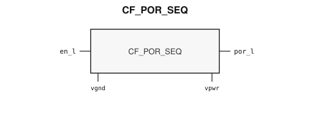

# CF_POR_SEQ

> Power-on-reset generator and initialization sequencer

The public GDS is an abstract; ChipFoundry
substitutes protected full geometry at tapeout.

This package ships an SRAM-style PG wrap `CF_POR_SEQ` around analog leaf
`CF_POR_SEQ_core`.

## Overview

`CF_POR_SEQ` is a SkyWater 130 nm hard-macro power-on-reset generator.
It asserts `por_l` while the supply is below the trip threshold and
releases it once the rail is valid, so digital logic comes up in a
defined order. Instantiate `CF_POR_SEQ`.

`en_l` is an active-low enable. Drive it low to run the detector;
drive it high to disable the analog POR.

Macro size is 171.95 × 119.835 µm (15 µm halo around analog leaf
141.95 × 89.835 µm). Customer PG for chip PDN is `vpwr` / `vgnd`.

## Installation

```bash
pip install cf-ipm
ipm install CF_POR_SEQ --version 0.2.1
```

Use `hdl/gl/CF_POR_SEQ.v` as the customer blackbox, `layout/lef/CF_POR_SEQ.lef`
for P&R, and `layout/gds/CF_POR_SEQ.gds` / `layout/mag/CF_POR_SEQ.mag` for the
public wrap. `CF_POR_SEQ_core` is the analog leaf (empty Verilog, pin-only
abstract). ChipFoundry substitutes vault GDS into `CF_POR_SEQ_core` at tapeout.
P&R uses the wrap LEF (`vpwr` / `vgnd` only). `timing/lib/` is the
characterized view. Functional sim compiles `verify/beh_model/CF_POR_SEQ_core.v`
**instead of** the empty `hdl/gl/CF_POR_SEQ_core.v` stub. See
`verify/beh_model/README.md`.

## Features

- Active-low POR output `por_l`
- Active-low analog enable `en_l`
- Compact always-on hard macro for bring-up and brown-out recovery
- Characterized Liberty under `timing/lib/` (ff / tt / ss)
- Ideal Verilog behavioral model under `verify/beh_model/` for functional sim
- Customer cell `CF_POR_SEQ` 171.95 × 119.835 µm (15 µm halo around analog leaf 141.95 × 89.835 µm)
- Chip PDN is `vpwr` / `vgnd`

## Pinout

Customer documentation includes a pinout of the integration cell only.
Internal schematics and architecture block diagrams are not published.



Pin names and directions match the public wrap (`layout/lef/CF_POR_SEQ.lef`)
and the blackbox stub (`hdl/gl/CF_POR_SEQ.v`).

## Pin Description

Directions and widths are taken from the shipped Verilog in `hdl/gl/CF_POR_SEQ.v`.

| Name | Direction | Width | Description |
|---|---|---:|---|
| `por_l` | output | 1 | Active-low power-on reset. |
| `en_l` | input | 1 | Active-low analog POR enable. |
| `vpwr` | input | 1 | Core supply. |
| `vgnd` | input | 1 | Ground. |

In OpenLane / LibreLane, hook chip PDN with
`PDN_MACRO_CONNECTIONS: "u_cf_por_seq vccd1 vssd1 vpwr vgnd"` and connect
`.vpwr(vccd1)`, `.vgnd(vssd1)` under `USE_POWER_PINS`.

## Specifications

Public views are a pin-only analog abstract plus the SRAM-style PG wrap.
This package does not invent trip-voltage or delay tables. Copy timing
from the shipped Liberty when a number is required.

- Technology: SkyWater 130 nm
- Customer wrap: 171.95 × 119.835 µm
- Analog leaf: 141.95 × 89.835 µm
- Chip PDN domain: `vccd1` / `vssd1` → `vpwr` / `vgnd`

## Timing Diagram

This wrap drop does not include a published timing diagram. Use the
Liberty waveforms in `timing/lib/` for the three shipped PVT corners.

## Tapeout History

This hard macro has high-volume commercial production history (millions of
units). Catalog and IPM maturity is Production.

This ChipFoundry SkyWater 130 nm package delivers an abstract for
integration. ChipFoundry substitutes protected full layout at tapeout.
The chipIgnite delivery of this package is not marked shuttle-proven until
a run returns.

| Version | Date | Notes |
|---|---|---|
| 0.2.0 | 2026-09-06 | First unpublished wrap draft. Analog leaf `CF_POR_SEQ_core`; customer `CF_POR_SEQ` exposes chip PDN `vpwr`/`vgnd`. |
| 0.2.1 | 2026-09-26 | Core fill-exclude covers so fillgen does not overwrite the analog. Ideal behavioral model for functional sim. |

## Limitations and Open Issues

- Verilog in `hdl/gl/CF_POR_SEQ.v` is a structural wrap around an empty
  `CF_POR_SEQ_core` blackbox. Functional sim uses
  `verify/beh_model/CF_POR_SEQ_core.v` (ideal detector, not a characterized trip).
- Companion sequencer, HV, and dense-nwell tops stay foundry-only. This
  package ships the wrap around the public analog POR leaf.
